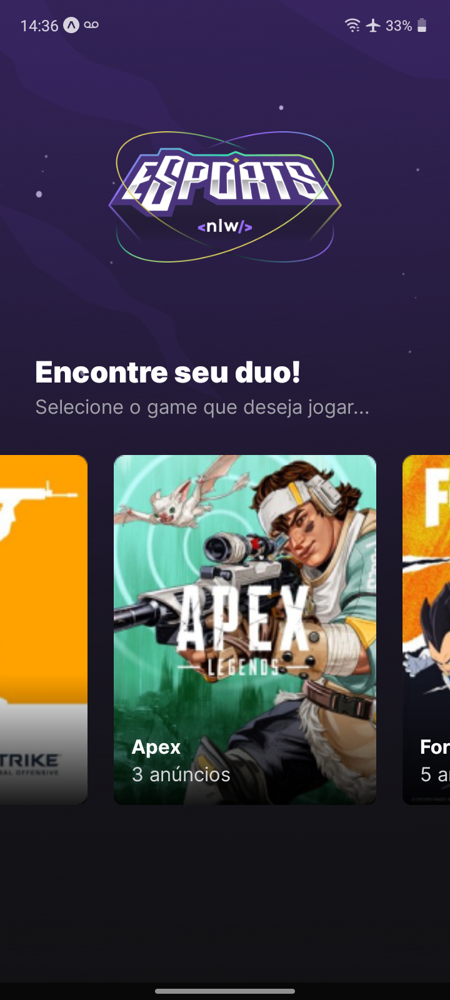

<h1 align="center">
  NLW eSports 💻
</h1>

 

  
  

## 💻 Projeto

O projeto foi desenvolvido em React_Native durante a Next Level Week #9 eSports da Rocketseat.

## ✨ Tecnologias

Esse projeto foi desenvolvido com as seguintes tecnologias:

- [React_Native](https://reactnative.dev/)
- [TypeScript](https://www.typescriptlang.org/)

## Utilização do projeto

### 💾 Baixar o projeto
Faça o clone do repositório para ter uma versão do projeto em sua máquina: 
`$ git clone https://github.com/ViniciusPrataKloh/nlw-esports-mobile.git`

### 🧰 Instalar dependências
`$ npm install`  

### 🚀 Iniciar o projeto
`$ npm start`
 

## 📝 Licença
Este projeto está licenciado nos termos da licença [MIT](https://github.com/ViniciusPrataKloh/nlw-esports-mobile.git/blob/main/LICENSE). 